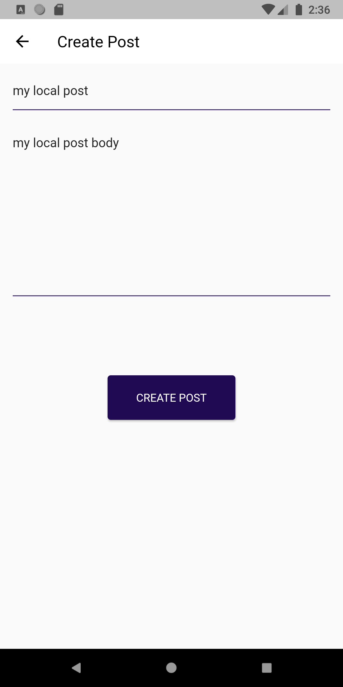
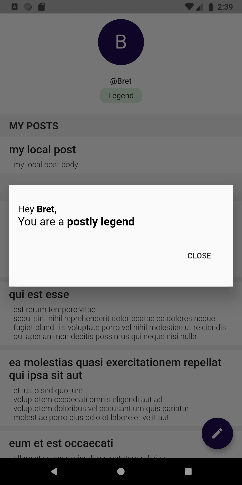
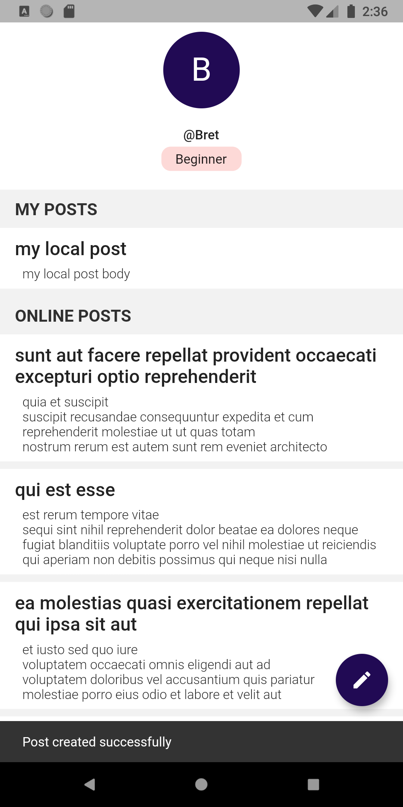

# Postly

Postly a social app that lets you share your thoughts and get comments from the community.

## Run Instructions
After pulling source code, get dependencies using the `flutter pub get` command  

Run the following command to initiate code generation.

-  If `make` is installed, `make update_models`
- Otherwise, `flutter pub pub run build_runner build --delete-conflicting-outputs`

Run the app by connecting a physical device or simulator to the development environment and running the `flutter run` command

Run unit tests using the `flutter test` command  

To run integration tests, connecting a physical device or simulator to the development environment and run the following command
- If  `make` is installed, `make drive_create_post`
- Otherwise, `flutter drive --target=test_driver/post/create.dart`

## Screenshots

    
